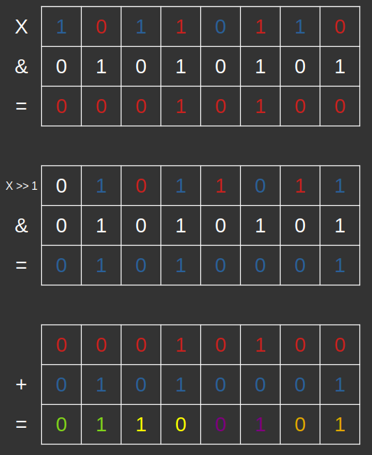

> **Zadanie 2.** Napisz ciąg instrukcji w języku C, który wyznaczy liczbę zapalonych bitów w zmiennej $x$.
>> **Uwaga!** Oczekiwana złożoność to $O(log n)$, gdzie $n$ to liczba bitów w słowie. Posłuż się strategią „dziel i zwyciężaj”.

```c
#include <stdio.h>

int main() {
    unsigned long x, m1, m2, m4, m8, m16;

    scanf("%lu", &x);

    uint32_t m1  = 0x55555555; 
    // 01 01 01 01 01 01 01 01 01 01 01 01 01 01 01 01
    uint32_t m2  = 0x33333333; 
    // 0011 0011 0011 0011 0011 0011 0011 0011
    uint32_t m4  = 0x0f0f0f0f; 
    // 00001111 00001111 00001111 00001111
    uint32_t m8  = 0x00ff00ff; 
    // 0000000011111111 0000000011111111
    uint32_t m16 = 0x0000ffff; 
    // 00000000000000001111111111111111
    
    x = (x & m1) + ((x >> 1) & m1);
    x = (x & m2) + ((x >> 2) & m2);
    x = (x & m4) + ((x >> 4) & m4);
    x = (x & m8) + ((x >> 8) & m8);
    x = (x & m16) + ((x >> 16) & m16);

    printf("%lu\n", x);

    return 0;
}
```

Najpierw liczymy zapalone bity osobno w każdej parze bitów. Następnie te pary zsumujemy w grupy 4-bitów. Będziemy postępować analogicznie (8, 16, 32 bity), dopóki nie pozostanie nam jedna grupa 32-bitowa, w której zapisane będzie nasze rozwiązanie.

