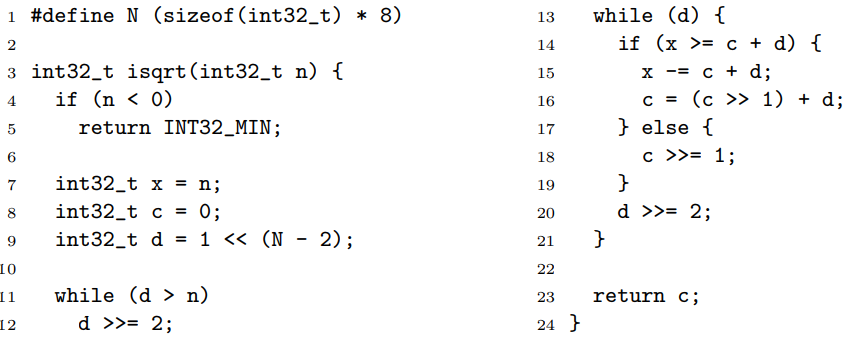

> **Zadanie 8**. Podobnie jak w poprzednim zadaniu: przetłumacz poniższą funkcję na kod trójkowy, po czym oznacz bloki podstawowe i narysuj graf przepływu sterowania dla poniższej funkcji napisanej w języku C.
>> 

```c
            param int32_t
            t1 = sizeof,1
            N = t1 * 8

ISQRT:      if (n < 0) goto END0            <<B0>>

            x = n                           <<B1>>
            c = 0
            t2 = N - 2
            d = 1 << t2

L0:         if (d <= n) goto L1             <<B2>>

            d = d >> 2                      <<B3>>
            goto L0

L1:         if (!d) goto END1               <<B4>>

            t3 = c + d                      <<B5>>
            if (x >= t3) goto L3
            
            c = c >> 1                      <<B6>>
            goto L4

L3:         x = x - t3                      <<B7>>
            t4 = c >> 1
            c = t4 + d

L4:         d = d >> 2                      <<B8>>
            goto L1

END0:       return INT32_MIN                <<B9>>

END1:       return c                        <<B10>>
```

```graphviz
digraph {
    graph [bgcolor=transparent]
    node [fillcolor=black fontcolor=white]
    START -> B0;
    B0 -> B1, B9;
    B1 -> B2;
    B2 -> B3, B4;
    B3 -> B2;
    B4 -> B5, B10;
    B5 -> B6, B7;
    B6 -> B8;
    B7 -> B8;
    B8 -> B4;
    B9 -> END;
    B10 -> END;
}
```