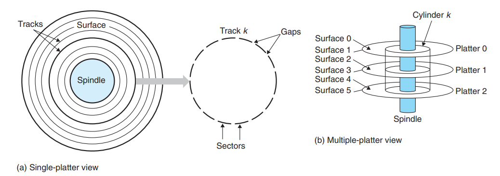
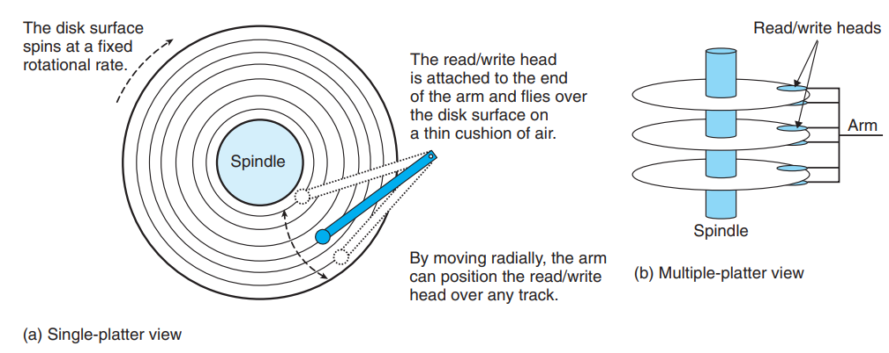
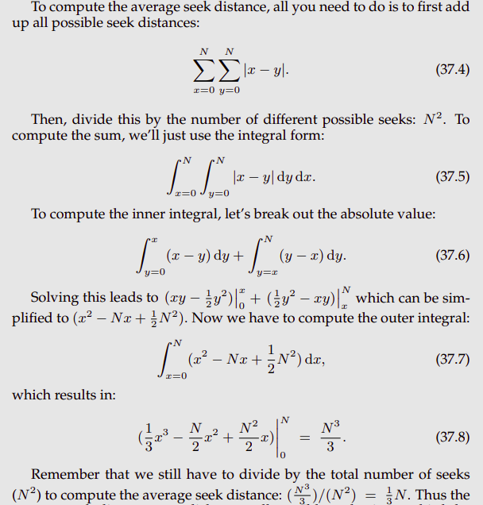

> **Zadanie 1.** Rozważmy dysk o następujących parametrach: jeden **plater**; jedna **głowica**; 576 tysięcy **ścieżek** na powierzchnię; 32000 **sektorów** na ścieżkę; 7200 obrotów na minutę; czas wyszukiwania: 1 ms na przeskoczenie o 24 tysięcy ścieżek. Odpowiedz na następujące pytania:

  

> ### Jaki jest średni **czas wyszukiwania** (ang. *seek time*)?
>
> Czas wyszukiwania to czas potrzebny na przesunięcie głowicy nad odpowiednią ścieżkę.  
>
> 
>
> $T_{avg \ seek} = \sum_{i = 1}^{576 \cdot 10^3} \sum_{j = 1}^{576 \cdot 10^3} (\frac{|i - j|}{24 \cdot 10^3} \ ms) \cdot (576 \cdot 10^3)^{-2} = \frac{1}{3} \cdot 576 \cdot 10^3 \cdot (24 \cdot 10^3)^{-1} \ ms \approx 8 \ ms$

> ### Jaki jest średni czas **opóźnienia obrotowego** (ang. *rotational latency*)?
>
> Czas opóźnienia obrotowego to czas potrzebny na obrócenie platera tak, żeby pod głowicą był szukany sektor.
>
> $T_{avg \ rotation} = \frac{1}{2} \cdot \frac{1}{7200} \ \frac{1}{RPM} \cdot 60 \ \frac{s}{min} \approx 0.004167 \ s = 4.167 \ ms$

> ### Jaki jest **czas transferu** (ang. *transfer time*) sektora?
>
> Czas transferu to czas potrzebny na przejście całego sektora w celu odczytu / zapisu.
>
> $T_{avg \ transfer} = \frac{1}{7200} \ \frac{1}{RPM} \cdot \frac{1}{32000} \ \frac{track}{sectors} \cdot 60 \ \frac{s}{min} \approx 0.0000002604167 \ s = 0.0002604167 \ ms$

> ### Jaki jest całkowity średni czas obsługi żądania?
>
> $T_{avg \ access} = T_{avg \ seek} + T_{avg \ rotation} + T_{avg \ transfer} \approx 12.1672604167 \ ms$