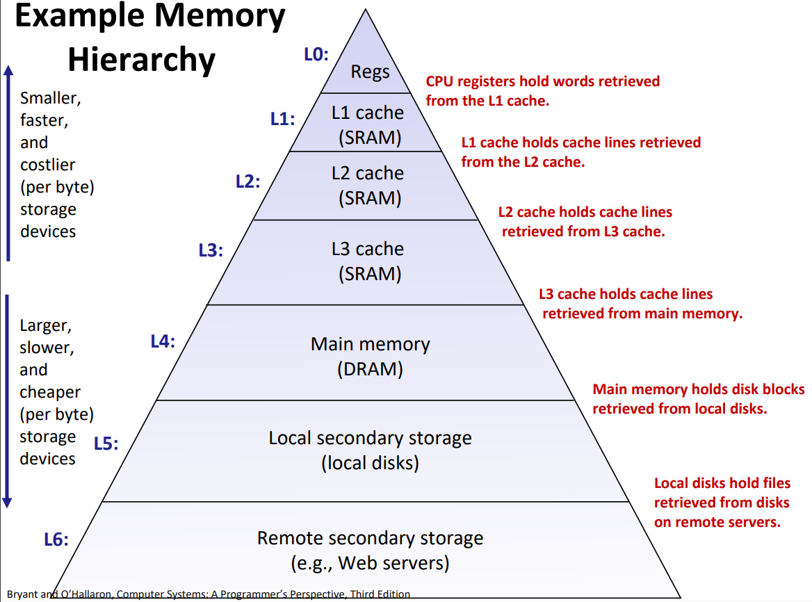

> **Zadanie 4.** Rozważamy umiarkowanie nowoczesny procesor `x86-64` (np. [i7-67004](https://www.7-cpu.com/cpu/Skylake.html)), o częstotliwości taktowania 2.5 GHz, z trzema poziomami **pamięci podręcznej**. Niech funkcja $A(k)$ wyznacza czas, w cyklach procesora, w którym pamięć $k$-tego poziomu odpowiada na pytanie czy przechowuje dany **blok** pamięci. Niech funkcja $H(k)$ wyznacza prawdopodobieństwo z jakim blok znajduje się na $k$-tym poziomie **hierarchii pamięci**, pod warunkiem, że nie znajduje się na wcześniejszych poziomach. Dla rozważanego systemu mamy: $A(L1) = 4, A(L2) = 12, A(L3) = 40, A(DRAM) = 200; H(L1) = 0.9, H(L2) = 0.95, H(L3) = 0.98, H(DRAM) = 1.0$. Jaki jest $(a)$ średni $(b)$ pesymistyczny czas dostępu do pamięci w nanosekundach?
>> **Pamiętaj!** Dostęp do pamięci na poziomie $k + 1$ zachodzi tylko wtedy, gdy chybiliśmy w pamięć na poziomie $k$.

$2.5 \ GHz \rightarrow 2.5 \ \frac{cycles}{ns}$

$(a) \ AvgTime = E(Hit) = 4 + 0.1 \cdot (12 + 0.05 \cdot (40 + 0.02 \cdot 200)) = 5.42 \ cycles = 5.42 / 2.5 \ ns = 2.168 \ ns$

$(b) \ PesTime = 4 + 12 + 40 + 200 = 256 \ cycles = 256 / 2.5 \ ns = 102.4 \ ns$