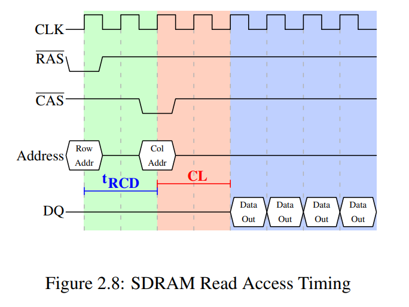
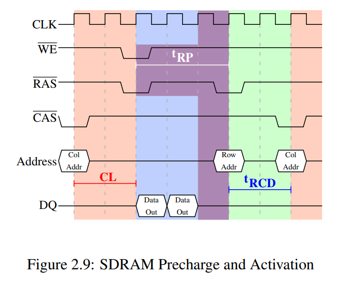

> **Zadanie 6.** Na podstawie [[2](https://www.akkadia.org/drepper/cpumemory.pdf), §2.2] zreferuj protokół komunikacji kontrolera pamięci z modułami **synchronicznej pamięci DRAM**. Posłuż się diagramami czasowymi przebiegu stanów logicznych. Wyjaśnij kroki jakie musi podjąć kontroler by odczytać jedno lub kilka kolejnych słów pamięci. Wyjaśnij źródło występowania opóźnień **bramkowania kolumny** $t_{CAS}$, **wyboru wiersza** $t_{RCD}$, **wstępnego ładowania wiersza** $t_{RP}$ i **bramkowania wiersza** $t_{RAS}$.
>> **Wskazówka:** Dokładne omówienie diagramów czasowych można znaleźć w [[3](https://github.com/KevinOfNeu/ebooks/blob/master/Memory%20systems%20Cache%20DRAM%20Disk.pdf), §11.1].

Synchroniczna pamięć DRAM działa względnie z pewnym licznikiem czasu (zegarem), wszystkie operacje wykonywane są sekwencyjnie jego względem.

Kontroler pamięci komunikuje się z modułem pamięci przy pomocy kilku sygnałów:
- `RAS` (*Row Address Selection*)
- `CAS` (*Column Address Selection*)
- `Address` (numer wiersza i kolumny)
- `DQ` (*Data Queue*)
- `WE` (*Write Enable*)

### Protokół odczytu danych:

Komórka pamięci ma przydzielony wirtualny adres, który przez procesor jest tłumaczony na adres fizyczny, który ostatecznie kontroler pamięci przekłada na adres odpowiedniego układu pamięci RAM, oraz w ramach tego układu odpowiednią lokalizacją kolumny i wiersza samej pamięci.

Na początku obniżany jest sygnał `RAS`, a na szynie `Address` umieszczany jest numer odpowiedniego wiersza. W czasie $t_{RCD}$ pamięć pobiera wybrany wiersz do bufora. Następnie obniżany jest sygnał `CAS`, a na szynie `Address` umieszczany jest numer odpowiedniej kolumny. W czasie $t_{CAS}$ pamięć odczytuje dane z kolumny i wysyła je do `DQ`. Kontroler może zadecydować o pobraniu więcej niż jednego słowa, co pozwala na wypełnienie pamięci podręcznej bez konieczności przesłania kolejnej sekwencji sygnałów. Może również zadecydować przesłaniu informacji o odczycie z innej kolumny aktywnego wiersza, bez konieczności transmitowania sygnału `RAS`.

Nie ma dedykowanego sygnału informującego o deaktywacji aktualnego wiersza. Intencję tą przekazuje się jednoczesną aktywacją sygnałów `RAS` i `WE`. W czasie $t_{RP}$ przywraca wartości do właściwych komórek pamięci i czyści bufor. Przez część tego czasu możliwy jest jeszcze przesył danych z zamykanego właśnie wiersza. Po upływie tego czasu (oraz $t_{RAS}$ potrzebnego na przygotowanie do wczytania kolejnego wiersza) kontroler może wybrać nowy wiersz do odczytu.

