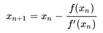

> #### Dla poniższych zadań należy podać kompletny algorytm, zatem dozwolona jest cała składnia języka C bez ograniczeń z nagłówka listy zadań. Jednakże należy używać wyłącznie operacji na typie `«int32_t»` lub `«uint32_t»`.
> **Zadanie 10 (bonus).** Na podstawie artykułów [0x5f3759df2](http://h14s.p5r.org/2012/09/0x5f3759df.html) oraz [0x5f3759df (appendix)](http://h14s.p5r.org/2012/09/0x5f3759df-appendix.html) zreferuj działanie algorytmu szybkiego przybliżania odwrotności pierwiastka kwadratowego z liczby typu `«float»`. Należy wyjaśnić podstawy obliczeń na binarnej reprezentacji liczby `«x»` i pochodzenie stałej `0x5f3759df`.

[Wikipedia](https://en.wikipedia.org/wiki/Fast_inverse_square_root)

Poniższy 'magiczny' algorytm służy do obliczania odwrotności pierwiastka kwadratowego i jest znany z wykorzystania w grze Quake III Arena:
```c
float FastInvSqrt(float x) {
  float xhalf = 0.5f * x;
  int i = *(int*)&x;         // evil floating point bit level hacking
  i = 0x5f3759df - (i >> 1);  // what the fuck?
  x = *(float*)&i;
  x = x*(1.5f-(xhalf*x*x));
  return x;
}
```

Zwykle obliczenie takiej wartości wiązało się z wielokrotnym dzieleniem na liczbach zmiennoprzecinkowych, które jest dość drogie. Ten algorytm jest dużo efektywniejszy i znalazł zastosowanie w obliczaniu kątu padania światła i odbić w grafice 3D. Jak ten algorytm tak właściwie działa?

- `float xhalf = 0.5f * x;`  
Najpierw zachowujemy wartość połowy $x$ na później.

- `int i = *(int*)&x;`  
W tej linijce reinterpretujemy liczbę $x$ jako liczbę całkowitą.

- `i = 0x5f3759df - (i >> 1);  // what the fuck?`  
Ta linijka jest najbardziej tajemnicza i przejdziemy do niej za chwilę. W dużym skrócie oblicza ona jakieś przybliżenie szukanej przez nas wartości, jeśli zinterpretować by liczbę jako `float`.

- `x = *(float*)&i;`  
Z powrotem konwertujemy naszą liczbę do liczby zmiennoprzecinkowej.

- `x = x*(1.5f-(xhalf*x*x));`  
Na sam koniec wykonujemy jedną iterację [metody Newtona](https://en.wikipedia.org/wiki/Newton%27s_method), aby polepszyć nasze przybliżenie.   
  
U nas $f(x) = \frac{1}{x} - i$, gdzie $1/sqrt(i)$, to szukana przez nas odwrotność pierwiastka, a $i$ to wartość pod pierwiastkiem. Zatem:  
  - $f(x) = x^{-2} - i; f'(x) = -2x^{-3}$
  - $x_{new} = x - \frac{x^{-2} - i}{-2x^{-3}} = 1.5x - 0.5ix^3 = x(1.5 - 0.5ix^2)$

Ostatni krok daje bardzo dobre przybliżenie, bo już przedostatni krok w 'magiczny' sposób przybliża zaskakująco poprawnie. Jak to się dzieje?

Rozważamy pierwiastki, więc pominiemy liczby ujemne.  
Jako $M$ i $E$ oznaczymy mantysę i wykładnik interpretowane w `int`, a $m$ i $e$ interpretowane w `float`. Wtedy:
- $m = \frac{M}{L}$
- $e = E - B$

Gdzie $L = 2^{23}; B = 127$  
Daną liczbę interpretujemy w następujący sposób:
- $(1 + m)2^e$ jako `float`
- $M + LE$ jako `int`

Szukamy wartości $y = x^{-\frac{1}{2}}$:

$$log_2y = -\frac{1}{2}log_2x \\ log_2(1 + m_y) + e_y = -\frac{1}{2}(log_2(1 + m_x) + e_x)$$

Po obu stronach równania mamy wyrażenia postaci $log_2(1 + v)$, gdzie $v$ leży w przedziale $(0, 1)$. Na takiej dziedzinie logarytm ten można przybliżyć prostą linią.

$$log_2(1 + v) ≈ v + \sigma \\ m_y + \sigma + e_y ≈ -\frac{1}{2}(m_x + \sigma + e_x) \\ \frac{M_y}{L} + \sigma + E_y - B ≈ -\frac{1}{2}(\frac{M_x}{L} + \sigma + E_x - B) \\ ... \\ M_y + LE_y ≈ \frac{3}{2}L(B - \sigma) - \frac{1}{2}(M_x + LE_x) \\ Y_{INT} ≈ \frac{3}{2}L(B - \sigma) - \frac{1}{2}X_{INT}$$

Czyli $y$ otrzymujemy odejmując od jakiejś stałej połowę $x$ (w świecie liczb całkowitych). Wybierzmy wartość stałej:
$\frac{3}{2}L(B - \sigma) = \frac{3}{2}2^{23}(127 - 0.0450465) = 1597463007_{10} = 5F3759DF_{16}$. 

Rozkodowaliśmy więc już 3. linijkę algorytmu. Co ciekawe 'magiczna stała' nie ma żadnego związku z patternem bitów, jest czysto matematyczna. Tak dobrana $\sigma$ minimalizuje błąd przybliżenia logarytmu i została dobrana [eksperymentalnie / numerycznie](https://en.wikipedia.org/wiki/Fast_inverse_square_root#Magic_number).