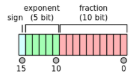

> **Zadanie 3.** Standard `IEEE 754-2008` definiuje liczby zmiennopozycyjne o szerokości $16$-bitów. Zapisz ciąg bitów reprezentujący liczbę $1.5625 \cdot 10^{−1}$. Porównaj zakres liczbowy i dokładność w stosunku do liczb zmiennopozycyjnych pojedynczej precyzji (`float`).

Format naszej liczby będzie wyglądał następująco:
- Znak: 1 bit
- Wykładnik: 5 bitów (Bias: $01111_2 = 15_{10}$)
- Mantysa: 10 bitów (nie licząc implicitnie pamiętanej $1$ na początku)

$1.5625 \cdot 10^{−1} = 0.15625$

$0.15625 \cdot 2 = 0.3125 \space | \space 0$  
$0.3125  \cdot 2 = 0.625 \space | \space 0$  
$0.625 \cdot 2 = 1.25 \space | \space 1$  
$0.25 \cdot 2 = 0.5 \space | \space 0$  
$0.5 \cdot 2 = 1 \space | \space 1$  
$0.15625_{10} = 0.00101_2 = 1.01_2 \cdot 2^{-3}$

- Znak: $0$, bo liczba jest dodatnia
- Wykładnik: $12_{10} = 01100_2$ ($-3 + 15$)
- Mantysa: $(1).0100000000_2$

Zatem $1.5625 \cdot 10^{−1} \rightarrow 0|01100|0100000000_2$

FP16:
- FP16_MAX = $0|11110|1111111111 = 2^{15} \cdot (1 + \frac{1023}{1024}) = 65504$  
- FP16_MIN = $0|00001|0000000000 = 2^{-14} ≈ 0.00006103515625 ≈ 6.1 \cdot 10^{-5}$  
- FP16_MAX_DENORM = $0|00000|1111111111 = 2^{-14} \cdot \frac{1023}{1024} ≈ 0.000060975552 ≈ 6.09 \cdot 10^{-5}$  
- FP_16_MIN_DENORM = $0|00000|0000000001 = 2^{-14} \cdot \frac{1}{1024} ≈ 0.000000059604645 ≈ 5.96 \cdot 10^{-8}$ 
- [Dokładna precyzja](https://en.wikipedia.org/wiki/Half-precision_floating-point_format#Precision_limitations) 

FP32:
- FP32_MAX = $0|11111110|11...11 = 2^{127} \cdot (2 - \frac{1}{2^{23}}) ≈ 3.4 \cdot 10^{38}$  
- FP32_MIN = $0|00000001|00...00 = 2^{-126} ≈ 1.17549435 \cdot 10^{-38}$
- FP32_MAX_DENORM = $0|00000000|11...11 = 2^{-126} \cdot \frac{2^{23}-1}{2^{23}} ≈ 1.1754942 \cdot 10^{-38}$  
- FP32_MIN_DENORM = $0|00000000|00...01 = 2^{-126} \cdot \frac{1}{2^{23}} ≈ 1.401 \cdot 10^{-45}$
- [Dokładna precyzja](https://en.wikipedia.org/wiki/Single-precision_floating-point_format#Precision_limitations_on_decimal_values_in_[1,_16777216])