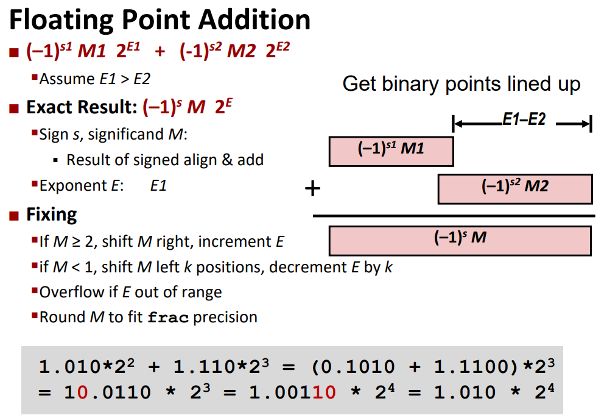
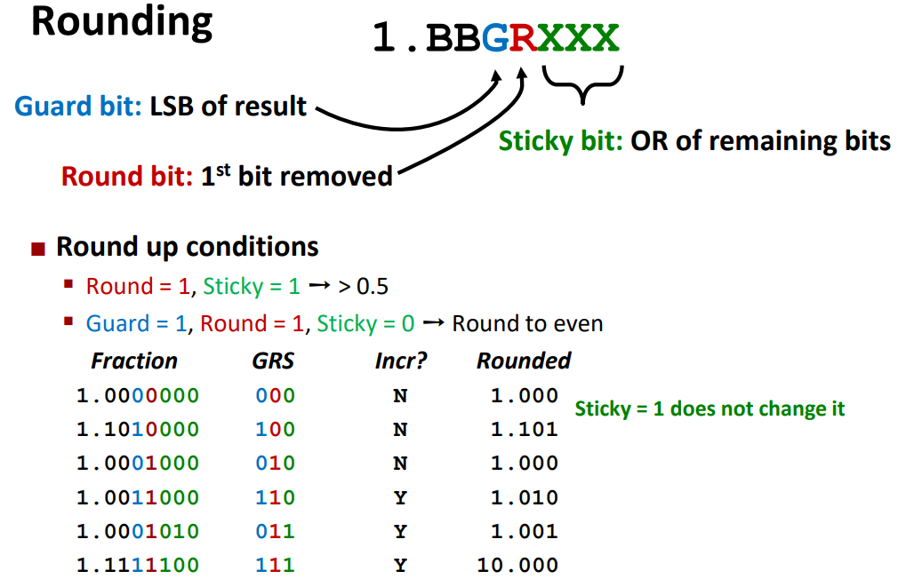

> **Zadanie 4.** Oblicz ręcznie $(a + b) + c$ oraz $a + (b + c)$, gdzie $a = 3.984375 \cdot 10^{−1}$, $b = 3.4375 \cdot 10^{−1}$ i $c = 1.771 \cdot 10^3$, używając liczb w formacie z poprzedniego zadania. Zapisz wynik binarnie i dziesiętnie. Zaprezentuj działanie algorytmu zaokrąglania liczb zmiennopozycyjnych i podaj definicje bitów **guard**, **round** i **sticky**. Zastanów się jak sumować ciągi liczb zmiennopozycyjnych, żeby zminimalizować błąd.
>> **Uwaga!** Domyślną metodą zaokrąglania w obliczeniach zmiennoprzecinkowych jest *round-to-even*.

- $a = 0.3984375_{10} = 0.0110011 = 2^{-2} \cdot 1.10011 \rightarrow 0 \ 01101 \ 1001100000$
- $b = 0.34375_{10} = 0.01011 = 2^{-2} \cdot 1.011 \rightarrow 0 \ 01101 \ 0110000000$ 
- $c = 1771_{10} = 11011101011.0 = 2^{10} \cdot 1.1011101011 \rightarrow 0 \ 11001 \ 1011101011$
- $a + b + c = 1771.7421875_{10}$

> ##### $(a + b) + c$
> $$(0.3984375_{10} + 0.34375_{10}) + 1771_{10} = \\ 2^{-2} \cdot (1.10011 + 1.01100) + 2^{10} \cdot 1.1011101011 = \\ 2^{-2} \cdot 10.11111 + 2^{10} \cdot 1.1011101011 = \\ 2^{-1} \cdot 1.011111 + 2^{10} \cdot 1.1011101011 = \\ 2^{10} \cdot (0.00000000001011111 + 1.10111010110000000) = \\ 2^{10} \cdot 1.1011101011(1011111) = \\ 2^{10} \cdot 1.1011101100 = 1772_{10}$$

> ##### $a + (b + c)$
> $$0.3984375_{10} + (0.34375_{10} + 1771_{10}) = \\ 2^{-2} \cdot 1.10011 + (2^{-2} \cdot 1.011 + 2^{10} \cdot 1.1011101011) = \\ 2^{-2} \cdot 1.10011 + 2^{10} \cdot (0.000000000001011 + 1.101110101100000) = \\ 2^{-2} \cdot 1.10011 + 2^{10} \cdot 1.1011101011(01011) = \\ 2^{-2} \cdot 1.10011 + 2^{10} \cdot 1.1011101011 = \\ 2^{10} \cdot (0.00000000000110011 + 1.10111010110000000) = \\ 2^{10} \cdot 1.1011101011(0110011) = \\ 2^{10} \cdot 1.1011101011 = 1771_{10}$$

Aby zminimalizować błąd należy najpierw dodawać liczby o bliskich sobie wykładnikach, aby nie tracić cyfr znaczących przez normalizację.