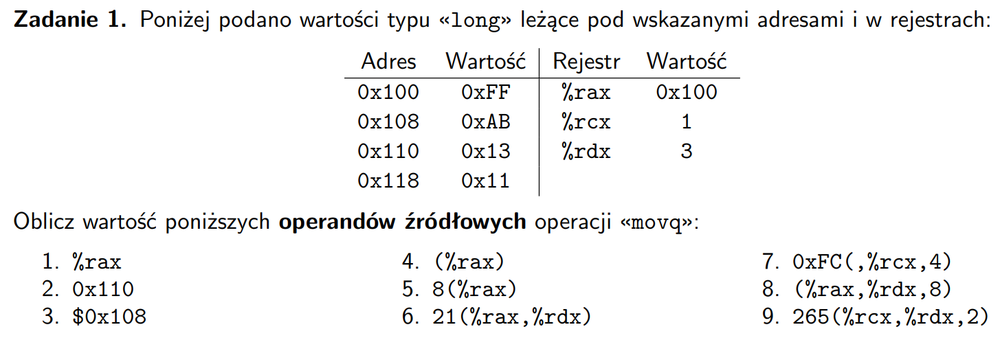
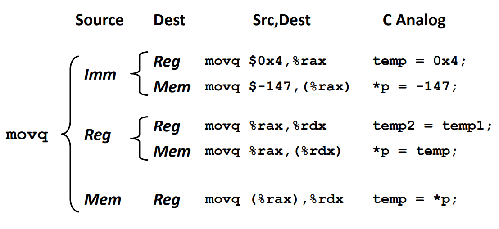

- $\%rax \rightarrow 0x100$
- $0x110 \rightarrow 0x13$
- $\$0x108 \rightarrow 0x108$
- $(\%rax) = 0x100 \rightarrow 0xFF$
- $8(\%rax) = 0x100 + 8 = 0x108 \rightarrow 0xAB$
- $21(\%rax, \%rdx) = 0x100 + 3 + 21 = 0x118 \rightarrow 0x11$
- $0xFC(, \%rcx, 4) = 4 * 1 + 0xFC = 0x100 \rightarrow 0xFF$
- $(\%rax, \%rdx, 8) = 0x100 + 8 * 3 = 0x118 \rightarrow 0x11$
- $265(\%rcx, \%rdx, 2) = 1 + 2 * 3 + 265 = 0x110 \rightarrow 0x13$