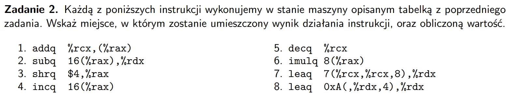
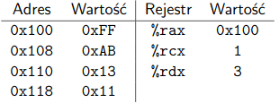

  
  

- `addq %rcx, (%rax)`: $0x100 \leftarrow 0xFF + 1 = 0x100$
- `subq 16(%rax), %rdx`: $\%rdx \leftarrow 3 - (0x100 + 16 = 0x110 \rightarrow 0x13) = -0x10 = 0xFFFFFFFFFFFFFFF0$
- `shrq $4, %rax`: $\%rax \leftarrow 0x100 >> 4 = 0x10$
- `incq 16(%rax)`: $0x110 \leftarrow 0x13 + 1 = 0x14$
- `decq %rcx`: $\%rcx \leftarrow 1 - 1 = 0$
- `imulq 8(%rax)`: $\%rdx:\$rax \leftarrow 0x100 \cdot (0x100 + 8 = 0x108 \rightarrow 0xAB) = 0xAB00$
- `leaq 7(%rcx, %rcx, 8), %rdx`: $\%rdx \leftarrow 1 + 8 * 1 + 7 = 0x10$
- `leaq 0xA(, %rdx, 4), %rdx` - $\%rdx \leftarrow 4 * 3 + 0xA = 0x16$