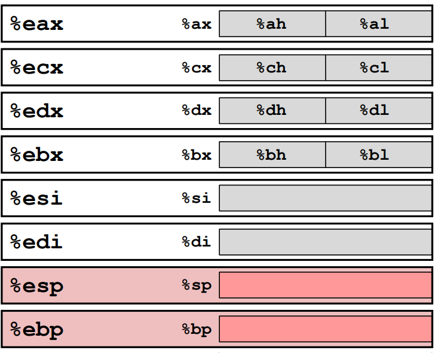

> **Zadanie 5.** Zaimplementuj w asemblerze `x86-64` procedurę konwertującą liczbę typu `«uint32_t»` między formatem *little-endian* i *big-endian*. Argument funkcji jest przekazany w rejestrze `%edi`, a wynik zwracany w rejestrze `%eax`. Należy użyć instrukcji cyklicznego przesunięcia bitowego `«ror»` lub `«rol»`.
>
> Podaj wyrażenie w języku C, które kompilator optymalizujący przetłumaczy do instrukcji `«ror»` lub `«rol»`.

# [Instrukcja ror](https://www.aldeid.com/wiki/X86-assembly/Instructions/ror)



```assembly
swap: movl %edi, %eax    ;ABCD
      rolw $8, %ax       ;ABDC
      roll $16 %eax      ;DCAB
      rolw $8 %ax        ;DCBA
      ret
```

```c
uint32_t rotate(uint32_t x, uint8_t n) {
    return x << n | x >> (32 - n);
}
```