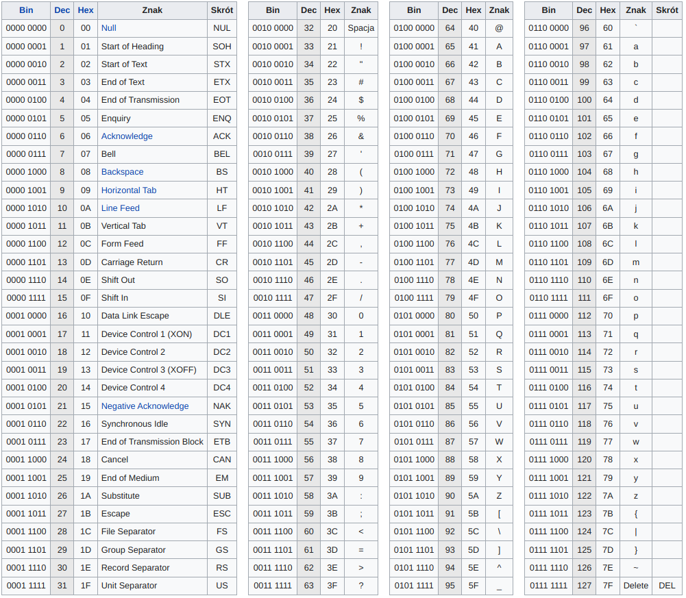

# Niedeklarowane
## To rozwiązanie modyfikuje niedozwolone znaki, bez modyfikacji tych znaków kod robi się za długi
## Można tutaj sprawdzać przedział podobnie jak w zadaniu 9.

> **Zadanie 8.** W rejestrze `%rax` przechowujemy osiem drukowalnych znaków w kodzie `ASCII`, tj. każdy bajt ma wartość od `0x20` do `0x7f`. Podaj kod w asemblerze `x86-64`, który minimalną liczbą instrukcji przepisze w rejestrze `%rax` wszystkie małe litery na duże litery.
>> **Źródło:** Zadanie 87 z [[1](https://ia601602.us.archive.org/29/items/B-001-001-251/B-001-001-251.pdf), 7.1.3].

# [Instrukcja movabsq](https://stackoverflow.com/questions/40315803/difference-between-movq-and-movabsq-in-x86-64)



Wykonamy operację $x \leftarrow x \ \& \ \lnot((x \ \& \ 01000000..._2) >> 1)$. Wtedy dla każdego bajtu $(a_7...a_0)_2$ otrzymamy bajt $(a_7a_6(a_5\land\bar{a_6})a_4...a_0)_2$. Jedynymi znakami, które ulegną modyfikacji są znaki z ostatniej kolumny tabeli. Niestety nie zawiera ona wyłącznie małych liter i 6 znaków spoza alfabetu zostanie zmodyfikowanych.

```assembly
toupper:    movabsq $0x4040404040404040, %r8 
            movq %rax, %rdi
            andq %r8, %rdi
            shrq %1, %rdi
            notq %rdi
            andq %rdi, %rax
            ret
```

