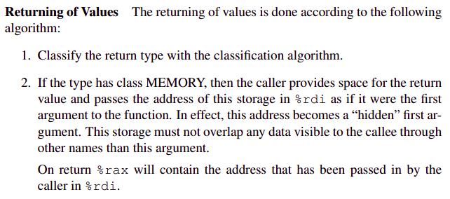

> **Zadanie 2.** Poniżej zamieszczono kod procedury o sygnaturze `«struct T puzzle2(long *a, long n)»`. Na jego podstawie podaj definicję typu `«struct T»`. Przetłumacz tę procedurę na język C, po czym jednym zdaniem powiedz co ona robi. Wyjaśnij działanie instrukcji `«cqto»` i `«idiv»`. Gdyby sygnatura procedury nie była wcześniej znana to jaką należałoby wywnioskować z poniższego kodu? Zauważ, że wynik procedury nie mieści się w rejestrach `%rax` i `%rdx`, zatem zostanie umieszczony w pamięci. Wskaż regułę w [[1](https://raw.githubusercontent.com/wiki/hjl-tools/x86-psABI/x86-64-psABI-1.0.pdf), 3.2.3], która wymusza takie zachowanie kompilatora.

# [Instrukcja movabsq](https://stackoverflow.com/questions/40315803/difference-between-movq-and-movabsq-in-x86-64)
# [Instrukcja idiv](https://www.felixcloutier.com/x86/idiv)
# [Instrukcja cqto](https://stackoverflow.com/a/10348927)
# [Instrukcje cmovg/cmovl](https://wiki.cheatengine.org/index.php?title=Assembler:Commands:CMOVG)


```assembly
puzzle2:    movq %rdx, %r11             ;%r11 <- n
            xorl %r10d, %r10d           ;i = 0
            xorl %eax, %eax             ;avg = 0
            movabsq $LONG_MIN, %r8      ;max = LONG_MIN
            movabsq $LONG_MAX, %r9      ;min = LONG_MAX
.L2:        cmpq %r11, %r10             ;while i < n 
            jge .L5                     ;(i >= n => jump L5)
            movq (%rsi,%r10,8), %rcx    ;aux = a[i]
            cmpq %rcx, %r9              ;if (min > aux)
            cmovg %rcx, %r9             ;min = aux
            cmpq %rcx, %r8              ;if (max < aux)
            cmovl %rcx, %r8             ;max = aux
            addq %rcx, %rax             ;avg += aux
            incq %r10                   ;i++
            jmp .L2
.L5:        cqto                        ;(int128_t) avg
            movq %r9, (%rdi)            ;res.min = min
            idivq %r11                  ;avg /= n
            movq %r8, 8(%rdi)           ;res.max = max
            movq %rax, 16(%rdi)         ;res.avg = avg
            movq %rdi, %rax
            ret                         ;return res
```

```c
struct T {long min, max, avg;}

struct T puzzle2(long *a, long n) {
    long max = LONG_MIN;
    long min = LONG_MAX;
    long avg = 0;
    for(int i = 0; i< n ; i++) {
        long aux = a[i];
        if (aux < min) min = aux;
        if (aux > max) max = aux;
        avg += aux;
    }
    struct A res = {min, max, result / n};
    return res;
}

// Wywnioskowana sygnatura:
// struct T *puzzle2(struct T *result, long *a, long n)
```

Procedura ta wyznacza wartość minimalną, maksymalną oraz średnią pośród elementów tablicy i zwraca strukturę zawierającą te informacje.

