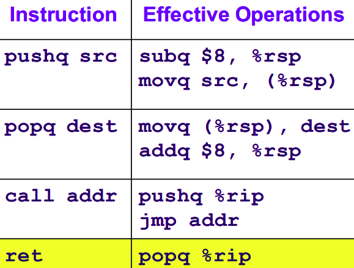

> **Zadanie 3.** Zakładamy, że producent procesora nie dostarczył instrukcji **skoku pośredniego**. Rozważmy procedurę `«switch_prob»` z poprzedniej listy. Podaj metodę zastąpienia `«jmpq *0x4006f8(,%rsi,8)»` ciągiem innych instrukcji. Nie można używać **kodu samomodyfikującego się** *(ang. self-modyfing code)*, ani dodatkowych rejestrów. Napisz kod w języku C, który wygeneruje instrukcję **pośredniego wywołania procedury**, np. `«call *(%rdi,%rsi,8)»`, a następnie zaprezentuj go posługując się stroną godbolt[²](https://godbolt.org/). Pokaż, że taką instrukcję też da się zastąpić, gdyby brakowało jej w zestawie instrukcji.

> ```assembly
> 400590 <switch_prob>:
> 400590: 48 83                       subq $0x3c,%rsi           ;n -= 60
> 400594: 48 83 fe 05                 cmpq $0x5,%rsi
> 400598: 77 29                       ja *0x4005c3              ;n >= 5 => jump default
> 40059a: ff 24 f5 f8 06 40 00        jmpq *0x4006f8(,%rsi,8)   ;jump n * 8 + 0x4006f8
> 4005a1: 48 8d 04 fd 00 00 00 00     lea 0x0(,%rdi,8),%rax     ;case 0/1
> 4005a9: c3                          retq
> 4005aa: 48 89 f8                    movq %rdi,%rax            ;case 4
> 4005ad: 48 c1 f8 03                 sarq $0x3,%rax
> 4005b1: c3                          retq
> 4005b2: 48 89 f8                    movq %rdi,%rax            ;case 2
> 4005b5: 48 c1 e0 04                 shlq $0x4,%rax
> 4005b9: 48 29 f8                    subq %rdi,%rax
> 4005bc: 48 89 c7                    movq %rax,%rdi
> 4005bf: 48 0f af ff                 imulq %rdi,%rdi           ;case 5
> 4005c3: 48 8d 47 4b                 leaq 0x4b(%rdi),%rax      ;case 3 (default)
> 4005c7: c3                          retq
> ```
>> ```assembly
>> (gdb) x/6gx 0x4006f8
>> 0x4006f8: 0x4005a1
>> 0x400700: 0x4005a1
>> 0x400708: 0x4005b2
>> 0x400710: 0x4005c3
>> 0x400718: 0x4005aa
>> 0x400720: 0x4005bf
>> ```



Wystarczy zamienić niedozwoloną instrukcję następującym ciągiem instrukcji:
```assembly
pushq 0x4006f8(,%rsi,8)
ret
```

Przykładowy kod z pośrednim wywołaniem procedury:
```c
#include "stdlib.h"
#include "stdio.h"
#include "time.h"

void fn1() {printf("fn1\n");}

void fn2() {printf("fn2\n");}

typedef void (*fn)();   //pointer to function with given signature

int main() {
    int c;
    fn fn_arr[] = {&fn1, &fn2};

    srand(time(NULL));
    c = rand() / (RAND_MAX / 2);
    switch (c) {
        case 0: (*(fn_arr[0]))(); break;
        case 1: (*(fn_arr[1]))(); break;
    }
}
```

Zamiast instrukcji wywołania pośredniego możemy użyć funkcji pomocniczej:
```assembly
call aux

aux:    pushq (%rdi,%rsi,8)
        ret
```