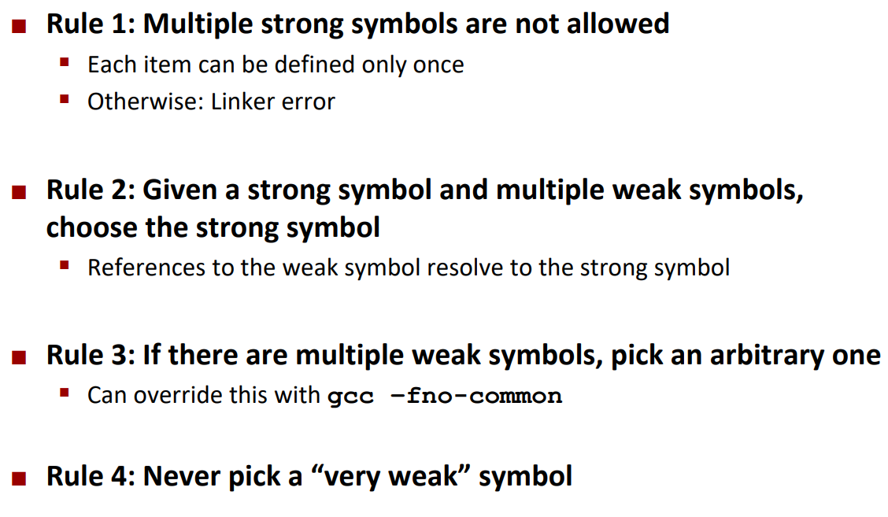

> **Zadanie 3.** Rozważmy program składający się z dwóch plików źródłowych:
>> ```c
>> /* mismatch-a.c */
>> void p2(void);
>> 
>> int main() {
>>   p2();
>>   return 0;
>> }
>> ```
>
>> ```c
>> /* mismatch-b.c */
>> #include <stdio.h>
>>
>> char main;
>>
>> void p2() {
>>   printf("0x%x\n", main);
>> }
>> ```
>
> Po uruchomieniu program drukuje pewien ciąg znaków i kończy działanie bez zgłoszenia błędu. Czemu tak się dzieje? Skąd pochodzi wydrukowana wartość? Czym różni się **symbol silny** od **słabego**? Zauważ, że zmienna `«main»` w pliku `«mismatch-a.c»` jest niezainicjowana. Co by się stało, gdybyśmy w funkcji `«p2»` przypisali wartość pod zmienną `«main»`? Co by się zmieniło gdybyśmy w pliku `«mismatch-b.c»` zainicjowali zmienną `«main»` w miejscu jej definicji? Czemu dobrym pomysłem jest przekazywanie opcji `«-fno-common»` do kompilatora?




```
gimboleo@gimboleo-BOHK-WAX9X  .../lista 8/code   main ●  ./mismatch
0x48
```

W pliku `«mismatch-b.c»` zmienna `«main»` jest niezainicjowana. Mamy zatem do czynienia ze słabym symbolem, który w trakcie konsolidacji zostanie przyporządkowany do silnego symbolu oznaczającego funkcję `«main»` w pliku `«mismatch-a.c»`. Nie otrzymujemy błędu, ponieważ zgodnie z konwencją wszystkie symbole zostały poprawnie rozwiązane.

W związku z tym zmienna `«main»` będzie w istocie interpretacją funkcji `«main»` jako znaku - instrukcja `«printf»` wyświetli pierwszy bajt kodowania tej procedury:
```
objdump -d mismatch-a.o

======================================================

mismatch-a.o:     file format elf64-x86-64


Disassembly of section .text:

0000000000000000 <main>:
   0:   48 83 ec 08             sub    $0x8,%rsp
   4:   e8 00 00 00 00          callq  9 <main+0x9>
   9:   b8 00 00 00 00          mov    $0x0,%eax
   e:   48 83 c4 08             add    $0x8,%rsp
  12:   c3                      retq   
```

Program po nadpisaniu w ciele funkcji `«p2»` zmiennej `«main»` zostałby pomyślnie skompilowany. Uruchomienie go skończyłoby się jednak naruszeniem ochrony pamięci, ponieważ spróbowaliśmy nadpisać pamięć, która dostępna jest wyłącznie do odczytu.

Program z dodaną inicjalizacją zmiennej `«main»` w pliku `«mismatch-b.c»` nie przeszedłby konsolidacji - linker znalazłby wiele silnych symboli o tej samej nazwie, stwierdził konfilkt i zakończył działanie.

Flaga `«-fno-common»` sprawia, że niezainicjalizowane zmienne globalne są umieszczane w sekcji `«.bss»`, gdzie traktuje się je, jakby były zainicjalizowane wartością zerową (domyślnie są w sekcji `«.common»`). Dzięki temu konsolidator nie jest w stanie merge'ować niezainicjalizowanych zmiennych - niemożliwe staje się utworzenie wielu zmiennych globalnych o tej samej nazwie w obrębie jednostki translacji, co zapobiega sytuacjom podobnym do powyższej.