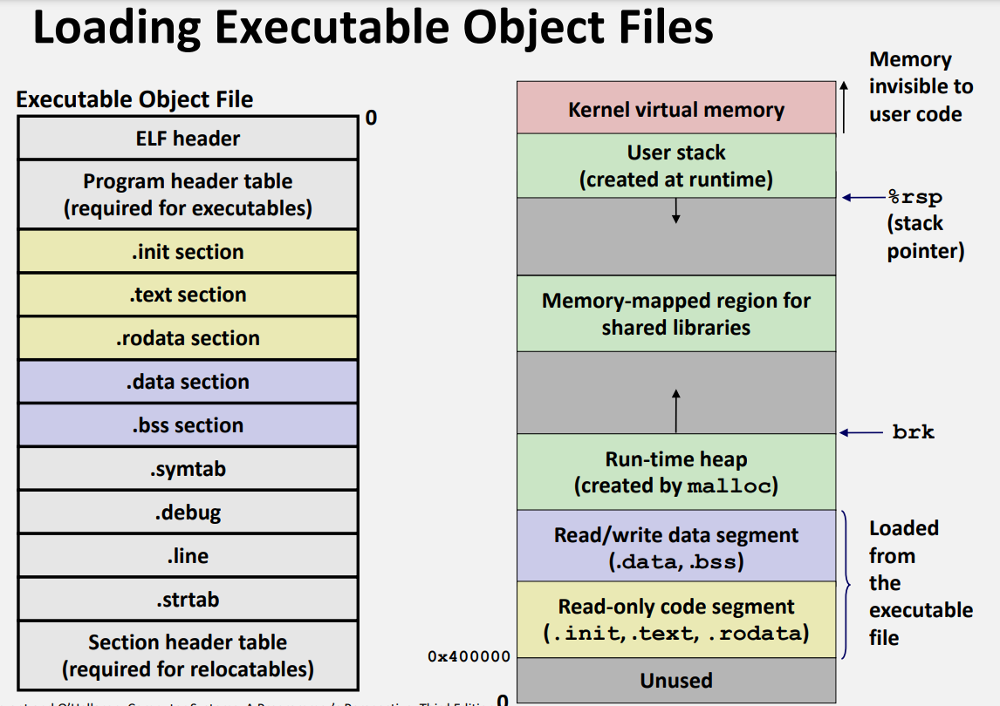

> **Zadanie 4.** Opisz znaczenie pól **nagłówka ELF** `«Elf64_Ehdr»` [[2](http://www.sco.com/developers/gabi/latest/contents.html), 4-3] oraz **tablicy rekordów nagłówków programu** `«Elf64_Phdr»` [[2](http://www.sco.com/developers/gabi/latest/contents.html), 5-1], zwanych również segmentami programu. Na podstawie zdobytej wiedzy omów wydruk polecenia `«readelf -h -l»` na pliku `«mismatch»`. Skąd wiadomo gdzie znajduje się pierwsza instrukcja **pliku wykonywalnego** [[1](https://github.com/Sorosliu1029/CSAPP-Labs/blob/master/Computer%20Systems%20A%20Programmers%20Perspective%20(3rd).pdf), §7.8]? Czy to będzie początek funkcji `«main»`? Pod jakie adresy wirtualne zostaną załadowane poszczególne segmenty programu? Które z sekcji nie zostaną załadowane do pamięci? Z których sekcji procesor będzie mógł wyłącznie czytać?

[Pola nagłówka `«Elf64_Ehdr»` ELF.](http://www.sco.com/developers/gabi/latest/ch4.eheader.html)

[Pola rekordów `«Elf64_Phdr»` tablicy nagłówków programu.](http://www.sco.com/developers/gabi/latest/ch5.pheader.html)

```
readelf -h -l mismatch

======================================================

ELF Header:
  Magic:   7f 45 4c 46 02 01 01 03 00 00 00 00 00 00 00 00 
  Class:                             ELF64
  Data:                              2's complement, little endian
  Version:                           1 (current)
  OS/ABI:                            UNIX - GNU
  ABI Version:                       0
  Type:                              EXEC (Executable file)
  Machine:                           Advanced Micro Devices X86-64
  Version:                           0x1
  Entry point address:               0x401b00
  Start of program headers:          64 (bytes into file)
  Start of section headers:          869768 (bytes into file)
  Flags:                             0x0
  Size of this header:               64 (bytes)
  Size of program headers:           56 (bytes)
  Number of program headers:         8
  Size of section headers:           64 (bytes)
  Number of section headers:         31
  Section header string table index: 30

Program Headers:
  Type           Offset             VirtAddr           PhysAddr
                 FileSiz            MemSiz              Flags  Align
  LOAD           0x0000000000000000 0x0000000000400000 0x0000000000400000
                 0x0000000000000488 0x0000000000000488  R      0x1000
  LOAD           0x0000000000001000 0x0000000000401000 0x0000000000401000
                 0x000000000009370d 0x000000000009370d  R E    0x1000
  LOAD           0x0000000000095000 0x0000000000495000 0x0000000000495000
                 0x000000000002664d 0x000000000002664d  R      0x1000
  LOAD           0x00000000000bc0c0 0x00000000004bd0c0 0x00000000004bd0c0
                 0x0000000000005170 0x00000000000068c0  RW     0x1000
  NOTE           0x0000000000000200 0x0000000000400200 0x0000000000400200
                 0x0000000000000044 0x0000000000000044  R      0x4
  TLS            0x00000000000bc0c0 0x00000000004bd0c0 0x00000000004bd0c0
                 0x0000000000000020 0x0000000000000060  R      0x8
  GNU_STACK      0x0000000000000000 0x0000000000000000 0x0000000000000000
                 0x0000000000000000 0x0000000000000000  RW     0x10
  GNU_RELRO      0x00000000000bc0c0 0x00000000004bd0c0 0x00000000004bd0c0
                 0x0000000000002f40 0x0000000000002f40  R      0x1

 Section to Segment mapping:
  Segment Sections...
   00     .note.gnu.build-id .note.ABI-tag .rela.plt 
   01     .init .plt .text __libc_freeres_fn .fini 
   02     .rodata .stapsdt.base .eh_frame .gcc_except_table 
   03     .tdata .init_array .fini_array .data.rel.ro .got .got.plt .data __libc_subfreeres __libc_IO_vtables __libc_atexit .bss __libc_freeres_ptrs 
   04     .note.gnu.build-id .note.ABI-tag 
   05     .tdata .tbss 
   06     
   07     .tdata .init_array .fini_array .data.rel.ro .got 
```



Pole `«e_entry»` nagłówka pliku ELF> trzyma wirtualny adres pierwszej instrukcji do wykonania po uruchomieniu programu *(entry point)*.

Pierwszą instrukcją programu nie będzie początek funkcji `«main»` - każdy program w języku C zaczyna się od wywołania funkcji `«_start»` (takiej samej dla wszystkich programów, zdefiniowana systemowo w `«crt1.o»`). Funkcja ta między innymi inicjalizuje środowisko uruchomieniowe, wywołuje funkcje `«_init»` oraz `«main»`, obsługuje zwróconą przez program wartość i zwraca kontrolę jądru systemu.

Poszczególne segmenty programu zostaną załadowane pod adresy pamięci zdefiniowane w tablicy rekordów nagłówków programu.

Program nie załaduje do pamięci między innymi tablicy symboli, tablicy nagłówków sekcji związanych z debuggowaniem (`«.line»`, `«.debug»`).

Procesor ma uprawnienia do zapisu wyłącznie w sekcjach `«.bss»` i `«.data»`.