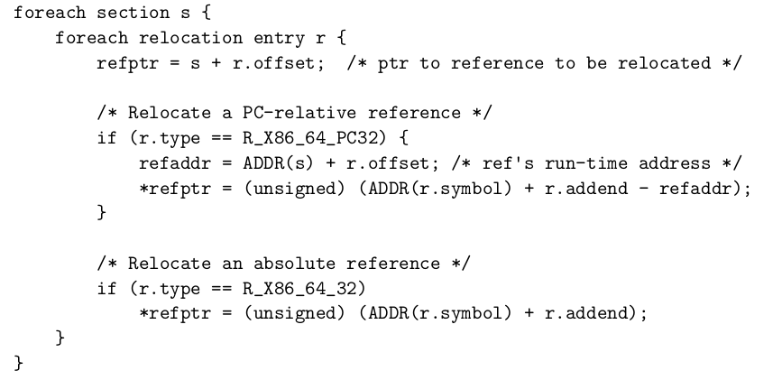

# NIEDEKLAROWANE - BŁĄD W ZADANIU (MIAŁY BYĆ RELOKACJE BEZWZGLĘDNE)

> **Zadanie 8.** W trakcie tłumaczenia poniższego kodu na asembler kompilator umieścił tablicę skoków dla instrukcji wyboru `switch` w sekcji `«.rodata»`. W wyniku konsolidacji pliku wykonywalnego zawierającego procedurę `«relo3»`, została ona umieszczona pod adresem `0x1000`, a tablica skoków pod `0x2000`.
>> ```c
>> int relo3(int val) {
>>   switch (val) {
>>     case 100:
>>       return val + 1;
>>     case 101:
>>     case 103 ... 104:
>>       return val + 3;
>>     case 105:
>>       return val + 5;
>>     case 107:
>>       return val + 7;
>>     default:
>>       return val + 11;
>>   }
>> }
>> ```
>
>> ```assembly
>> 0000000000000000 <relo3>:
>>  0: 8d 47 9c             lea -0x64(%rdi),%eax
>>  3: 83 f8 07             cmp $0x7,%eax
>>  6: 77 22                ja 2a <relo3+0x2a>
>>  8: 89 c0                mov %eax,%eax
>>  a: 48 8d 15 00 00 00 00 lea 0x0(%rip),%rdx
>>  11: 48 63 04 82         movslq (%rdx,%rax,4),%rax
>>  15: 48 01 d0            add %rdx,%rax
>>  18: ff e0               jmpq *%rax
>>  1a: 8d 47 01            lea 0x1(%rdi),%eax
>>  1d: c3                  retq
>>  1e: 8d 47 03            lea 0x3(%rdi),%eax
>>  21: c3                  retq
>>  22: 8d 47 05            lea 0x5(%rdi),%eax
>>  25: c3                  retq
>>  26: 8d 47 07            lea 0x7(%rdi),%eax
>>  29: c3                  retq
>>  2a: 8d 47 0b            lea 0xb(%rdi),%eax
>>  2d: c3                  retq
>> ```
>
> Oblicz wartości, które należy wstawić w miejsca referencji, do których odnoszą się poniższe rekordy relokacji otrzymane poleceniem `«objdump -r»`.



>> ```
>> RELOCATION RECORDS FOR [.text]:
>> OFFSET TYPE VALUE
>> 000000000000000d R_X86_64_PC32 .rodata-0x0000000000000004 *refptr = 0x2000 - 0x4 - 0x1000 - 0xd = 0xfef
>> RELOCATION RECORDS FOR [.rodata]:
>> OFFSET TYPE VALUE
>> 0000000000000000 R_X86_64_PC32 .text+0x000000000000001a   *refptr = 0x1000 + 0x1a - 0x2000 - 0x0 = unsigned(0x-fe6)
>> 0000000000000004 R_X86_64_PC32 .text+0x0000000000000022   *refptr = 0x1000 + 0x22 - 0x2000 - 0x4 = unsigned(0x-fe2)
>> 0000000000000008 R_X86_64_PC32 .text+0x0000000000000032   *refptr = 0x1000 + 0x32 - 0x2000 - 0x8 = unsigned(0x-fe6)
>> 000000000000000c R_X86_64_PC32 .text+0x000000000000002a   *refptr = 0x1000 + 0x2a - 0x2000 - 0xc = unsigned(0x-fe2)
>> 0000000000000010 R_X86_64_PC32 .text+0x000000000000002e   *refptr = 0x1000 + 0x2e - 0x2000 - 0x10 = unsigned(0x-fe2)
>> 0000000000000014 R_X86_64_PC32 .text+0x0000000000000036   *refptr = 0x1000 + 0x36 - 0x2000 - 0x14 = unsigned(0x-fde)
>> 0000000000000018 R_X86_64_PC32 .text+0x0000000000000042   *refptr = 0x1000 + 0x42 - 0x2000 - 0x18 = unsigned(0x-fd6)
>> 000000000000001c R_X86_64_PC32 .text+0x0000000000000042   *refptr = 0x1000 + 0x42 - 0x2000 - 0x1c = unsigned(0x-fda)
>> ```