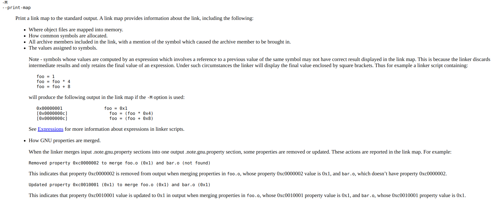

> **Zadanie 9.** Posiłkując się narzędziem [objdump](https://sourceware.org/binutils/docs/binutils/objdump.html) podaj rozmiary sekcji `«.data»` i `«.bss»` plików `«bar.o»` i `«foo.o»`. Wskaż rozmiar i pozycje symboli względem początków odpowiednich sekcji.
>> ```c
>> /* bar.c */
>> int bar = 42;
>> short dead[15];
>> ```
>
>> ```c
>> /* foo.c */
>> long foo = 19;
>> char code[17];
>> ```
>
> Na czym polega proces **częściowej konsolidacji** (ang. *partial linking*), którą można osiągnąć wywołując polecenie [ld](https://sourceware.org/binutils/docs/ld/index.html) z opcją `«-r»`? Czym różni się sposób wygenerowania plików `«merge-1.o»` i `«merge-2.o»`? Na podstawie **mapy konsolidacji** (pliki `«*.map»`) porównaj pozycje symboli i rozmiary sekcji w plikach wynikowych. Z czego wynikają różnice skoro konsolidator nie dysponuje informacjami o typach języka C?

```
objdump -h bar.o

======================================================

bar.o:     file format elf64-x86-64

Sections:
Idx Name          Size      VMA               LMA               File off  Algn
  0 .text         00000000  0000000000000000  0000000000000000  00000040  2**0
                  CONTENTS, ALLOC, LOAD, READONLY, CODE
  1 .data         00000004  0000000000000000  0000000000000000  00000040  2**2
                  CONTENTS, ALLOC, LOAD, DATA
  2 .bss          0000001e  0000000000000000  0000000000000000  00000050  2**4
                  ALLOC
  3 .comment      00000028  0000000000000000  0000000000000000  00000050  2**0
                  CONTENTS, READONLY
  4 .note.GNU-stack 00000000  0000000000000000  0000000000000000  00000078  2**0
                  CONTENTS, READONLY
```

```
objdump -h foo.o

======================================================

foo.o:     file format elf64-x86-64

Sections:
Idx Name          Size      VMA               LMA               File off  Algn
  0 .text         00000000  0000000000000000  0000000000000000  00000040  2**0
                  CONTENTS, ALLOC, LOAD, READONLY, CODE
  1 .data         00000008  0000000000000000  0000000000000000  00000040  2**3
                  CONTENTS, ALLOC, LOAD, DATA
  2 .bss          00000011  0000000000000000  0000000000000000  00000050  2**4
                  ALLOC
  3 .comment      00000028  0000000000000000  0000000000000000  00000050  2**0
                  CONTENTS, READONLY
  4 .note.GNU-stack 00000000  0000000000000000  0000000000000000  00000078  2**0
                  CONTENTS, READONLY
```

```
readelf -s -t bar.o

======================================================

There are 9 section headers, starting at offset 0x188:

Section Headers:
  [Nr] Name
       Type              Address          Offset            Link
       Size              EntSize          Info              Align
       Flags
  [ 0] 
       NULL             0000000000000000  0000000000000000  0
       0000000000000000 0000000000000000  0                 0
       [0000000000000000]: 
  [ 1] .text
       PROGBITS         0000000000000000  0000000000000040  0
       0000000000000000 0000000000000000  0                 1
       [0000000000000006]: ALLOC, EXEC
  [ 2] .data
       PROGBITS         0000000000000000  0000000000000040  0
       0000000000000004 0000000000000000  0                 4
       [0000000000000003]: WRITE, ALLOC
  [ 3] .bss
       NOBITS           0000000000000000  0000000000000050  0
       000000000000001e 0000000000000000  0                 16
       [0000000000000003]: WRITE, ALLOC
  [ 4] .comment
       PROGBITS         0000000000000000  0000000000000050  0
       0000000000000028 0000000000000001  0                 1
       [0000000000000030]: MERGE, STRINGS
  [ 5] .note.GNU-stack
       PROGBITS         0000000000000000  0000000000000078  0
       0000000000000000 0000000000000000  0                 1
       [0000000000000000]: 
  [ 6] .symtab
       SYMTAB           0000000000000000  0000000000000078  7
       00000000000000c0 0000000000000018  6                 8
       [0000000000000000]: 
  [ 7] .strtab
       STRTAB           0000000000000000  0000000000000138  0
       000000000000000a 0000000000000000  0                 1
       [0000000000000000]: 
  [ 8] .shstrtab
       STRTAB           0000000000000000  0000000000000142  0
       0000000000000045 0000000000000000  0                 1
       [0000000000000000]: 

Symbol table '.symtab' contains 8 entries:
   Num:    Value          Size Type    Bind   Vis      Ndx Name
     0: 0000000000000000     0 NOTYPE  LOCAL  DEFAULT  UND 
     1: 0000000000000000     0 SECTION LOCAL  DEFAULT    1 
     2: 0000000000000000     0 SECTION LOCAL  DEFAULT    2 
     3: 0000000000000000     0 SECTION LOCAL  DEFAULT    3 
     4: 0000000000000000     0 SECTION LOCAL  DEFAULT    4 
     5: 0000000000000000     0 SECTION LOCAL  DEFAULT    5 
     6: 0000000000000000    30 OBJECT  GLOBAL DEFAULT    3 dead
     7: 0000000000000000     4 OBJECT  GLOBAL DEFAULT    2 bar
```

```
readelf -s -t foo.o

======================================================

There are 9 section headers, starting at offset 0x188:

Section Headers:
  [Nr] Name
       Type              Address          Offset            Link
       Size              EntSize          Info              Align
       Flags
  [ 0] 
       NULL             0000000000000000  0000000000000000  0
       0000000000000000 0000000000000000  0                 0
       [0000000000000000]: 
  [ 1] .text
       PROGBITS         0000000000000000  0000000000000040  0
       0000000000000000 0000000000000000  0                 1
       [0000000000000006]: ALLOC, EXEC
  [ 2] .data
       PROGBITS         0000000000000000  0000000000000040  0
       0000000000000008 0000000000000000  0                 8
       [0000000000000003]: WRITE, ALLOC
  [ 3] .bss
       NOBITS           0000000000000000  0000000000000050  0
       0000000000000011 0000000000000000  0                 16
       [0000000000000003]: WRITE, ALLOC
  [ 4] .comment
       PROGBITS         0000000000000000  0000000000000050  0
       0000000000000028 0000000000000001  0                 1
       [0000000000000030]: MERGE, STRINGS
  [ 5] .note.GNU-stack
       PROGBITS         0000000000000000  0000000000000078  0
       0000000000000000 0000000000000000  0                 1
       [0000000000000000]: 
  [ 6] .symtab
       SYMTAB           0000000000000000  0000000000000078  7
       00000000000000c0 0000000000000018  6                 8
       [0000000000000000]: 
  [ 7] .strtab
       STRTAB           0000000000000000  0000000000000138  0
       000000000000000a 0000000000000000  0                 1
       [0000000000000000]: 
  [ 8] .shstrtab
       STRTAB           0000000000000000  0000000000000142  0
       0000000000000045 0000000000000000  0                 1
       [0000000000000000]: 

Symbol table '.symtab' contains 8 entries:
   Num:    Value          Size Type    Bind   Vis      Ndx Name
     0: 0000000000000000     0 NOTYPE  LOCAL  DEFAULT  UND 
     1: 0000000000000000     0 SECTION LOCAL  DEFAULT    1 
     2: 0000000000000000     0 SECTION LOCAL  DEFAULT    2 
     3: 0000000000000000     0 SECTION LOCAL  DEFAULT    3 
     4: 0000000000000000     0 SECTION LOCAL  DEFAULT    4 
     5: 0000000000000000     0 SECTION LOCAL  DEFAULT    5 
     6: 0000000000000000    17 OBJECT  GLOBAL DEFAULT    3 code
     7: 0000000000000000     8 OBJECT  GLOBAL DEFAULT    2 foo
```

**Częściowa konsolidacja** (ang. *partial linking*) to konsolidacja plików relokowalnych w plik relokowalny (zamiast w plik wykonywalny). Można ją wymusić na konsolidatorze flagą «-r». Taka konsolidacja umożliwia podzielenie dużej aplikacji na części, skonsolidowanie każdej z niej oddzielnie, a następnie skonsolidowanie wszystkich części w plik wykonywalny.

Sposób wygenerowania plików `«merge-1.o»` i `«merge-2.o»` róźni się kolejnością łączenia plików `.o`:
```
merge-1.map: foo.o bar.o
	$(LD) -M=$@ -r -o merge-1.o $^

merge-2.map: bar.o foo.o 
	$(LD) -M=$@ -r -o merge-2.o $^
```



W mapach konsolidacji możemy zauważyć różnice w rozmiarach sekcji. Wynikają one z konieczności wyrównań, które musi wykonać konsolidator. Co prawda nie dysponuje on informacjami o typach danych, lecz wymagane wyrównania są zapisane w nagłówkach sekcji. 