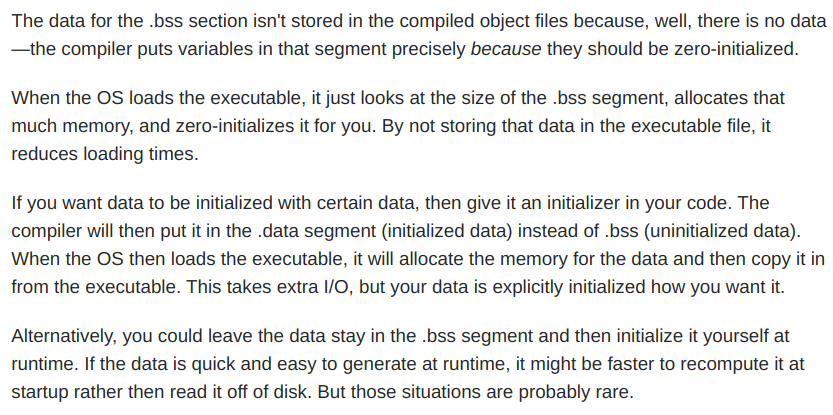

> **Zadanie 1.** Poniżej zamieszczono uproszczony wynik kompilacji pliku `«data.c»` do asemblera. Z jakimi [opcjami](https://gcc.gnu.org/onlinedocs/gcc/Option-Summary.html) **sterownik kompilatora** (tj. polecenie `gcc`) wywołał kompilator języka C (tj. polecenie `«cc1»`), aby otrzymać plik `«data.s»`? Na podstawie dokumentu [GNU as: Assembler Directives](https://sourceware.org/binutils/docs/as/Pseudo-Ops.html) wyjaśnij znaczenie **dyrektyw asemblera** użytych w poniższym kodzie. Które z dyrektyw przełączają bieżącą sekcję, dopisują zawartość do odpowiednich sekcji, modyfikują informacje przechowywane w nagłówku sekcji lub tablicę symboli?

```assembly
data.s <= gcc -ggdb -Og -Wall -g0 -fno-common -S -o data.s data.c

======================================================

	.globl foo				// Symbol globalny widziana przez linker
	.data					// Przełączenie się do sekcji .data
	.align 2				// Automatyczny alignment
	.type foo, @object		// Typ symbolu
	.size foo, 2			// Rozmiar symbolu
foo:
	.value 314				// Wartość symbolu

	.section .rodata		// Przełączenie się do sekcji .rodata
	.type abc, @object
	.size abc, 4
abc:
	.string "abc"
	.globl bar
	.bss
	.align 8
	.type bar, @object
	.size bar, 8
bar:
	.zero 8					// Wypełnienie zerami

	.globl array
	.bss
	.align 32
	.type array, @object
	.size array, 800
array:
	.zero 800
	.globl some
	.data
	.align 32
	.type some, @object
	.size some, 38
some:
	.quad weird				// Zainicjalizowane 64 bity
	.long -3				// Zainicjalizowane 32 bity
	.zero 4
	.quad abc
	.quad foo
	.string "efghi"
```

