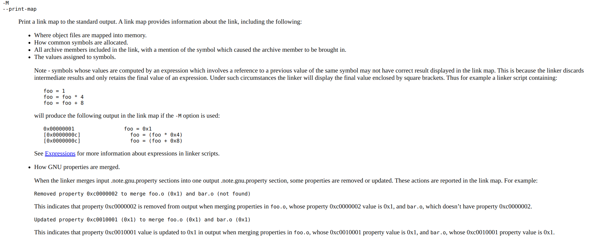

> **Zadanie 2.** Poniżej zamieszczono uproszczony wynik kompilacji plików `«start.c»`, `«odd.c»` i `«even.c»` do asemblera. W wygenerowanych plikach wskaż miejsca występowania definicji symboli i referencji do symboli. Czemu asembler nie może wygenerować ostatecznego ciągu bajtów reprezentujących instrukcje `«call»` i `«jmp»`? Zweryfikuj to wyświetlając zdeasemblowany kod przy pomocy `«objdump -d»`. Jakie informacje asembler zostawia w plikach relokowalnych, żeby konsolidator mógł uzupełnić te instrukcje? Przypomnij uczestnikom zajęć jakie są główne zadania pełnione przez konsolidator – posłuż się w tym celu **mapą konsolidacji** z pliku `«start.map»`. Pokaż, że konsolidator uzupełnił wymienione instrukcje w pliku wykonywalnym `«start»` na podstawie skryptu konsolidatora w pliku `«start.lds»`.

> ```assembly
> start.s
> 
> ======================================================
> 
>     .text
>     .globl _start
>     .type _start, @function
> _start:                         // Definicja symbolu
>     pushq %rax
>     movl $42, %edi
>     call is_even                // Referencja do zewnętrznego symbolu
>     movl %eax, %edi
>     movl $60, %eax
>     syscall
>     popq %rdx
>     ret
>     .size _start, .-_start
> ```
> 
> ```
> objdump -d start.o
> 
> ======================================================
> 
> start.o:     file format elf64-x86-64
> 
> 
> Disassembly of section .text:
> 
> 0000000000000000 <_start>:
>    0:   50                      push   %rax
>    1:   bf 2a 00 00 00          mov    $0x2a,%edi
>    6:   e8 00 00 00 00          callq  b <_start+0xb>     // Niepełna instrukcja
>    b:   89 c7                   mov    %eax,%edi
>    d:   b8 3c 00 00 00          mov    $0x3c,%eax
>   12:   0f 05                   syscall 
>   14:   5a                      pop    %rdx
>   15:   c3                      retq 
> ```

> ```assembly
> odd.s
> 
> ======================================================
> 
>     .text
>     .globl is_odd
>     .type is_odd, @function
> is_odd:                         // Definicja symbolu
>     testq %rdi, %rdi
>     je .L2
>     decq %rdi
>     jmp is_even                 // Referencja do zewnętrznego symbolu
> .L2:
>     xorl %eax, %eax
>     ret
>     .size is_odd, .-is_odd
> ```
> 
> ```
> objdump -d odd.o
> 
> ======================================================
> 
> Disassembly of section .text:
> 
> 0000000000000000 <is_odd>:
>    0:   48 85 ff                test   %rdi,%rdi
>    3:   74 08                   je     d <is_odd+0xd>
>    5:   48 ff cf                dec    %rdi
>    8:   e9 00 00 00 00          jmpq   d <is_odd+0xd>     // Niepełna instrukcja
>    d:   31 c0                   xor    %eax,%eax
>    f:   c3                      retq  
> ```

> ```
> even.s
> 
> ======================================================
> 
>     .text
>     .globl is_even
>     .type is_even, @function
> is_even:                        // Definicja symbolu
>     testq %rdi, %rdi
>     je .L2
>     decq %rdi
>     jmp is_odd                  // Referencja do zewnętrznego symbolu
> .L2:
>     movl $1, %eax
>     ret
>     .size is_even, .-is_even
> ```
> 
> ```
> objdump -d even.o
> 
> ======================================================
> 
> Disassembly of section .text:
> 
> 0000000000000000 <is_even>:
>    0:   48 85 ff                test   %rdi,%rdi
>    3:   74 08                   je     d <is_even+0xd>
>    5:   48 ff cf                dec    %rdi
>    8:   e9 00 00 00 00          jmpq   d <is_even+0xd>    // Niepełna instrukcja
>    d:   b8 01 00 00 00          mov    $0x1,%eax
>   12:   c3                      retq  
> ```

----

Gdy asembler generuje plik `.o` nie wie, gdzie kod i dane będą ostatecznie przechowywane w pamięci. Nie zna też lokalizacji żadnych zewnętrznie zdefiniowanych funkcji / zmiennych globalnych, do których odwołuje się moduł. Dlatego za każdym razem, gdy asembler napotyka referencję do symbolu, którego którego ostateczna lokalizacja nie jest znana, generuje rekord relokacji, który mówi konsolidatorowi jak zmodyfikować to odwołanie, gdy połączy pliki `.o` w plik wykonywalny. W miejsce referencji wpisze same zera, które zastąpi właściwym adresem w trakcie relokacji.

Rekord relokacji:
```c
typedef struct {
    long offset;    /* Offset of the reference to relocate */
    long type:32,   /* Relocation type (absolute / relative)*/
         symbol:32; /* Symbol table index */
    long addend;    /* Constant part of relocation expression */
} Elf64_Rela;
```

----



Główne zadania konsolidatora to rozwiązywanie symboli i relokacja.

```
start.map (zawiera istotne dla nas informacje z start.lds)

======================================================


Discarded input sections

 .comment       0x0000000000000000       0x28 even.o
 .note.GNU-stack
                0x0000000000000000        0x0 even.o
 .comment       0x0000000000000000       0x28 odd.o
 .note.GNU-stack
                0x0000000000000000        0x0 odd.o
 .comment       0x0000000000000000       0x28 start.o
 .note.GNU-stack
                0x0000000000000000        0x0 start.o

Memory Configuration

Name             Origin             Length             Attributes
*default*        0x0000000000000000 0xffffffffffffffff

Linker script and memory map

                0x00000000004000e8                . = (0x400000 + SIZEOF_HEADERS)

.text           0x00000000004000e8       0x39
 *(.text .text.*)
 .text          0x00000000004000e8       0x13 even.o
                0x00000000004000e8                is_even
 .text          0x00000000004000fb       0x10 odd.o
                0x00000000004000fb                is_odd
 .text          0x000000000040010b       0x16 start.o
                0x000000000040010b                _start

.rodata
 *(.rodata .rodata.*)

.eh_frame       0x0000000000400128       0x60
 .eh_frame      0x0000000000400128       0x30 even.o
 .eh_frame      0x0000000000400158       0x18 odd.o
                                         0x30 (size before relaxing)
 .eh_frame      0x0000000000400170       0x18 start.o
                                         0x30 (size before relaxing)

.data           0x0000000000400188        0x0
 *(.data .data.*)
 .data          0x0000000000400188        0x0 even.o
 .data          0x0000000000400188        0x0 odd.o
 .data          0x0000000000400188        0x0 start.o

.bss            0x0000000000400188        0x0
 *(.bss .bss.*)
 .bss           0x0000000000400188        0x0 even.o
 .bss           0x0000000000400188        0x0 odd.o
 .bss           0x0000000000400188        0x0 start.o
 *(COMMON)

/DISCARD/
 *(.rela.*)
 *(.iplt .iplt.*)
 *(.igot .igot.*)
 *(.got .got.*)
 *(.comment)
 *(.note.gnu.property)
 *(.note.GNU-stack)
LOAD even.o
LOAD odd.o
LOAD start.o
OUTPUT(start elf64-x86-64)
```

----

```
objdump -d start

======================================================

start:     file format elf64-x86-64


Disassembly of section .text:

00000000004000e8 <.text>:
  4000e8:       48 85 ff                test   %rdi,%rdi    // is_even
  4000eb:       74 08                   je     0x4000f5
  4000ed:       48 ff cf                dec    %rdi
  4000f0:       e9 06 00 00 00          jmpq   0x4000fb     // Uzupełniona instrukcja (jmp is_odd)
  4000f5:       b8 01 00 00 00          mov    $0x1,%eax
  4000fa:       c3                      retq   

  4000fb:       48 85 ff                test   %rdi,%rdi    // is_odd
  4000fe:       74 08                   je     0x400108
  400100:       48 ff cf                dec    %rdi
  400103:       e9 e0 ff ff ff          jmpq   0x4000e8     // Uzupełniona instrukcja (jmp is_even)
  400108:       31 c0                   xor    %eax,%eax
  40010a:       c3                      retq   

  40010b:       50                      push   %rax         // _start
  40010c:       bf 2a 00 00 00          mov    $0x2a,%edi
  400111:       e8 d2 ff ff ff          callq  0x4000e8     // Uzupełniona instrukcja (call is_even)
  400116:       89 c7                   mov    %eax,%edi
  400118:       b8 3c 00 00 00          mov    $0x3c,%eax
  40011d:       0f 05                   syscall 
  40011f:       5a                      pop    %rdx
  400120:       c3                      retq
```